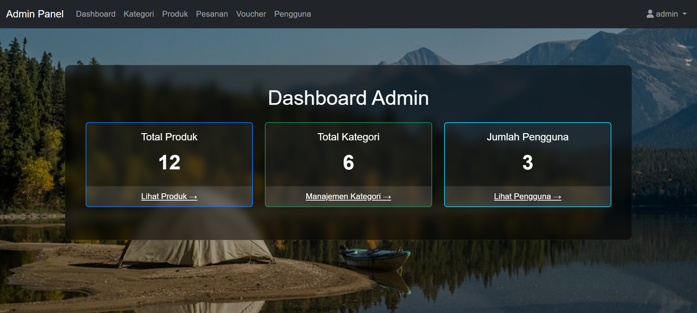

# Jejak Petualang - Aplikasi E-Commerce

Jejak Petualang adalah aplikasi web e-commerce yang dirancang untuk penjualan produk secara online. Aplikasi ini dibangun menggunakan PHP Native dan menyediakan fungsionalitas lengkap mulai dari penelusuran produk oleh pengguna hingga manajemen data oleh admin.

## Preview Aplikasi

  
*Tampilan halaman utama*

  
*Dashboard admin*

*More Images: jejakpetualang/images/*

## Fitur Utama

Aplikasi ini memiliki dua peran utama: Pengguna (Pelanggan) dan Admin.

### Fitur Pengguna

- **Autentikasi**: Pengguna dapat mendaftar, login, dan logout. Termasuk fitur reset password.
- **Beranda**: Menampilkan produk-produk unggulan.
- **Galeri Produk**: Melihat semua produk yang tersedia dengan sistem pencarian.
- **Detail Produk**: Melihat informasi rinci tentang produk, termasuk deskripsi, harga, dan stok.
- **Keranjang Belanja**: Menambah, mengubah jumlah, dan menghapus produk dari keranjang.
- **Checkout**: Melakukan proses pemesanan dengan mengisi detail pengiriman.
- **Manajemen Akun**: Pengguna dapat melihat dan memperbarui informasi profil serta riwayat pesanan.
- **Sistem Ulasan**: Pengguna dapat memberikan ulasan pada produk yang telah dibeli.

### Fitur Admin

- **Dashboard**: Halaman utama yang menampilkan ringkasan statistik penjualan atau data penting lainnya.
- **Manajemen Produk (CRUD)**: Admin dapat menambah, melihat, mengubah, dan menghapus data produk.
- **Manajemen Kategori**: Mengelola kategori produk.
- **Manajemen Pesanan**: Melihat daftar pesanan yang masuk dan memperbarui statusnya.
- **Manajemen Pengguna**: Mengelola data pengguna yang terdaftar.
- **Manajemen Voucher/Promo**: Membuat dan mengelola kode voucher atau promo.

## Teknologi yang Digunakan

- **Backend**: PHP (Native)
- **Database**: MySQL (atau MariaDB)
- **Frontend**: HTML, CSS, JavaScript
- **Server Web**: Apache (biasanya bagian dari XAMPP atau WAMP)

## Panduan Instalasi

Untuk menjalankan proyek ini secara lokal, ikuti langkah-langkah berikut:

### 1. Clone Repositori

```bash
git clone https://github.com/sulujulianto/jejakpetualang.git
```

Atau unduh file ZIP dan ekstrak ke direktori server web Anda.

### 2. Pindahkan ke Direktori Server

Pindahkan folder proyek `jejakpetualang` ke dalam direktori `htdocs` (jika Anda menggunakan XAMPP) atau `www` (jika Anda menggunakan WAMP).

### 3. Buat Database

- Buka `phpMyAdmin` (`http://localhost/phpmyadmin`).
- Buat database baru dengan nama `db_jejakpetualang` (atau nama lain yang Anda inginkan).
- Import file `jejakpetualang/jejakpetualang.sql` yang tersedia di repositori ke database yang baru Anda buat.

### 4. Salin & Konfigurasi Berkas `.env`

- Duplikat berkas contoh dengan perintah `cp .env.example .env`.
- Buka `.env` lalu sesuaikan nilai `DB_HOST`, `DB_NAME`, `DB_USER`, dan `DB_PASS` dengan kredensial database lokal Anda.

### 5. Pasang Dependensi Composer

- Pastikan Composer telah terinstal di mesin Anda.
- Jalankan `composer install` di akar proyek untuk mengunduh autoloader dan library `vlucas/phpdotenv` yang dibutuhkan.

### 6. Jalankan Aplikasi

- Buka browser Anda dan akses URL: `http://localhost/jejakpetualang`


## Cara Penggunaan

- **Akses Halaman Utama**: Buka `http://localhost/jejakpetualang`
- **Akses Panel Admin**: Buka `http://localhost/jejakpetualang/admin`. Gunakan kredensial admin dari database Anda untuk masuk.

## Langkah Setelah Melakukan Perbaikan

Setelah Anda melakukan perubahan kode sesuai kebutuhan, ikuti langkah berikut untuk menyimpan dan mendorong (push) pembaruan ke GitHub:

1. **Periksa perubahan yang belum disimpan**
   ```bash
   git status
   ```
   Pastikan hanya berkas yang ingin Anda kirim yang tercantum sebagai "modified" atau "untracked".

2. **Stage berkas yang diperbarui**
   ```bash
   git add path/ke/berkas1 path/ke/berkas2
   ```
   Atau tambahkan semuanya sekaligus dengan `git add .` bila Anda yakin seluruh perubahan sudah siap.

3. **Buat commit dengan pesan yang jelas**
   ```bash
   git commit -m "Ringkasan singkat perubahan"
   ```
   Gunakan kalimat yang menggambarkan tujuan perubahan, misalnya `git commit -m "Tambahkan perlindungan CSRF pada form"`.

4. **Sinkronkan branch lokal dengan remote (opsional)**
   ```bash
   git pull --rebase origin nama-branch
   ```
   Langkah ini memastikan branch lokal Anda selalu mengikuti pembaruan terbaru di GitHub.

5. **Kirim commit ke GitHub**
   ```bash
   git push origin nama-branch
   ```
   Ganti `nama-branch` dengan branch yang sedang Anda gunakan, misalnya `main` atau `feature/csrf`.

6. **Buat Pull Request (jika menggunakan branch fitur)**
   - Buka repositori di GitHub.
   - Klik tombol **Compare & pull request**.
   - Isi deskripsi singkat mengenai perubahan, kemudian kirim pull request untuk ditinjau.

---

**Jejak Petualang** - *Memulai petualangan belanja online Anda!*

